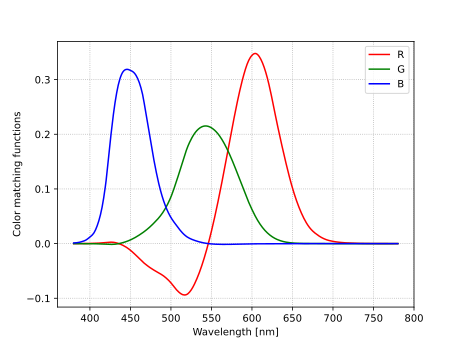

# Doppler Color Shift
A library to color shift images to see them as if you were moving at astronomical speeds towards/away from the image.
It's implemented in rust so it can also be compiled to web assembly and run directly in the browser.


# Algorithm

All the spectra below are written as continuous functions over wavelength. In reality they are sampled at discreet values but that precision can be easily changed by using more or fewer points.

## Convert RGB to spectrum
Color matching functions are three functions (`r, g, b: λ -> I`) defining relatively how much of each of the three primary colors do we need in order to match the color of a single wavelength.


Using these functions we can construct a new function using the given `(R, G, B)` values  
`S(λ) = R r(λ) + G g(λ) + B b(λ)`

## Color shift the spectrum
Once we have the spectrum color shifting is easy. We just have to change the spectrum argument by a factor of `k = sqrt((1+v/c)/(1-v/c))`:  
`P(λ) = S(k*λ) = R r(kλ) + G g(kλ) + B b(kλ)`  
Where `c` is the speed of light and `v` is the velocity of the observer relative to the original emitter.

## Convert the spectrum back to RGB

We want to approximate the new spectrum as much as possible using the color matching functions to get our new `(R', G', B')` values.

This problem can be formalized as minimization of the function
```
F = Integrate (R' r(λ) + G' g(λ) + B' b(λ) - P(λ))^2 dλ
```

Minimization means that for all `X in {R, G, B}` the derivations `dF/dX'` should be zero.
```
dF/dX' = 0 = 2 Integrate (R' r(λ) + G' g(λ) + B' b(λ) - S(λ)) x(λ) dλ
= R' Integrate r(λ) x(λ) dλ + B' Integrate g(λ) x(λ) dλ + B' Integrate b(λ) x(λ) dλ - Integrate P(λ) x(λ) dλ
```
By denoting `I_xy = Integrate x(λ) y(λ) dλ` we can write the three equations we got from the above derivation
```
R' I_rr + G' I_gr + B' I_br = I_Pr 
R' I_rg + G' I_gg + B' I_bg = I_Pg 
R' I_rb + G' I_gb + B' I_bb = I_Pb 
```
which can be written in matrix form as
```
|I_rr, I_br, I_gr| |R'|   |I_Pr|
|I_rg, I_bg, I_gg| |G'| = |I_Pg|
|I_rb, I_bb, I_gb| |B'|   |I_Pb|
```
## Precalculation and simplification
We can then pre-solve the system and find that 
```
    |I_rr, I_br, I_gr|^-1   | 0.1648514774, -0.0553485679,  0.0192844005 |
M = |I_rg, I_bg, I_gg|    = |-0.0553485679,  0.3617779291, -0.0318172340 |
    |I_rb, I_bb, I_gb|      | 0.0192844005, -0.0318172340,  0.2274085623 |
```
Additionally we can expand the right hand side to
```
|I_Pr|   |Integrate P(λ) r(λ) dλ|             | R r(kλ)r(λ) + G g(kλ)r(λ) + B b(kλ)r(λ) |        |R|
|I_Pg| = |Integrate P(λ) g(λ) dλ| = Integrate | R r(kλ)g(λ) + G g(kλ)g(λ) + B b(kλ)g(λ) | dλ = H |G|
|I_Pb|   |Integrate P(λ) b(λ) dλ|             | R r(kλ)b(λ) + G g(kλ)b(λ) + B b(kλ)b(λ) |        |B|
```
wWhere we defined the matrix `H` as
```
              |r(kλ)r(λ), g(kλ)r(λ), b(kλ)r(λ)|
H = Integrate |r(kλ)g(λ), g(kλ)g(λ), b(kλ)g(λ)| dλ
              |r(kλ)b(λ), g(kλ)b(λ), b(kλ)b(λ)|
```
Which means that finally we can get the new RGB values simply by multiplying
```
|R'|       |R|
|G'| = M.H |G|
|B'|       |B|
```
While `M` is a static value independent of all input parameters, `H` depends on the velocity that we are using to color shift. That means that `M` can be hardcoded but `H` has to be calculated for every new velocity we are trying to calculate. This process is still lightning fast, because once we have `M` and `H` we only have to multiply each pixel in an image with a `3x3` matrix `M.H`. Additionally because the pixels are independent of each other we are free to use as much parallelism as your computer can handle.

# Transformation algorithm using colors spaces

## Color space

Color space is a way of denoting a specific color using a combination a predefined set of primary colors. There are many color spaces that use different shades of red green and blue as the primary colors like sRGB, AdobeRGB, CIE RGB,... Out of all of them sRGB is by far the most widely used. If you've ever written `rgb(211, 47, 47)` or `#d32f2f` to denote a color in any context that was most likely sRGB.

There are also systems like CMYK (Cyan, Magenta, Yellow, Black) that use completely different primaries (or the same number of them) to denote colors. And strangely there are systems like CIE XYZ whose primaries don't relate to any possible color but were merely constructed as a mathematical tool to be able to describe all of the colors perceivable by humans and beyond.

## Convert sRGB pixel into CIE RGB

In order to do any color shifting we need to use a color space where the primary colors have a well defined wavelengths. Sadly the widely used sRGB does not fit that description.

We take a single sRGB pixel `sRGB(sR, sG, sB)` and convert it via CIE XYZ color space into a CIE RGB.
```
sRGB(sR, sG, sB) = XYZ(X, Y, Z) = cieRGB(R, G, B)
```
There primaries are defined as single wavelength colors:
```
(Red=700nm, Green=546.1nm, Blue=435.8nm) = (λr, λg, λb)
```

## Color shift CIE RGB primaries with relativistic Doppler effect

When an emitter and an observer of light are moving relative to each other their perception of the light's wavelength will differ by a factor of
```
k(v) = √((1-v/c)/(1+v/c))
```
where `v` is the relative velocity between the two and `c` is the speed of light.

This means that the primaries now become
```
(λr, λg, λb) -> (k(v)*λr, k(v)*λg, k(v)*λb) = (λ1, λ2, λ3)
```

## Construct a new color space using the shifted primaries

Using the newly found primary colors we will construct a new color space we will call the dopRGB color space.  
`{[dR], [dG], [dB]}` are the base vectors defining the dopRGB color space and `{[X], [Y], [Z]}` define the XYZ color space.

Lets denote vectors in each space as
```
dopRGB(A, B, C) = A [dR] + B [dG] + C [dB]
XYZ(A, B, C) = A [X] + B [Y] + C [Z]
```

We want to find the transformation between the two systems 
```
[d#] = XYZ(x#, y#, z#)
```
for all `#=R,G,B`.

Because `[dR] [dG] [dB]` represent pure wavelengths we can use the XYZ color matching function (CMF) to get the chromaticity for each vector but not its absolute value.
```
CMF(λ#) = XYZ(Cx#, Cy#, Cz#)
[d#] = K# CMF(λ#)
```
We can solve the for the unknowns `(Kr, Kg, Kb)` by equating the white points in two systems
```
dopRGB(1, 1, 1) = XYZ(1, 1, 1)
Kr CMF(λr) + Kg CMF(λg) + Kb CMF(λb) = XYZ(1, 1, 1)
XYZ(Kr Cxr + Kg Cxg + Kb Cxb, Kr Cyr + Kg Cyg + Kb Cyb, Kr Czr + Kg Czg + Kb Czb) = XYZ(1, 1, 1)
```
Or as written in matrix form, the equation we have to solve for `(Kr, Kg, Kb)` is
```
|Cxr, Cxg, Cxb| |Kr|   |1|
|Cyr, Cyg, Cyb| |Kg| = |1|
|Czr, Czg, Czb| |Kb|   |1|
```
Which gives us the solution for transforming the base vectors in dopRGB to CIE XYZ:
```
[dR] = Kr Cxr [X] + Kr Cyr [Y] + Kr Czr [Z]
[dG] = Kg Cxg [X] + Kg Cyg [Y] + Kg Czg [Z]
[dB] = Kb Cxb [X] + Kb Cyb [Y] + Kb Czb [Z]
```
We can use that to get actual coordinate transformation in matrix form
```
|X|   |Kr Cxr, Kg Cxg, Kb Cxb| |dR|
|Y| = |Kr Cyr, Kg Cyg, Kb Cyb| |dG|
|Z|   |Kr Czr, Kg Czg, Kb Czb| |dB|
```

## Convert from dopRGB to sRGB

Thanks to the calculation in the previous section we know how to convert dopRGB colors to XYZ. So we take the CIE RGB values reinterpret them as a vector in the dopRGB color space and convert it into XYZ.
```
dopRGB(R, G, B) -> XYZ(X', Y', Z')
```
We can then use known methods to convert that back to sRGB and display it.
```
XYZ(X', Y', Z') -> sRGB(sR, sG, sB)
```

## Pseudo code
```
function convert(image, velocity):
  dopRGB2XYZ := createdopRGB2XYZ(velocity)
  for pixel in image:
  	sRGB := pixel.color
    RGB := XYZ2RGB(sRGB2XYZ(sRGB))
    pixel.color = XYZ2sRGB(dopRGB2XYZ(RGB))
```

Using the Doppler formula convert 

# Sources
* [A Beginner’s Guide to (CIE) Colorimetry by Chandler Abraham on Medium](https://medium.com/hipster-color-science/a-beginners-guide-to-colorimetry-401f1830b65a)
* [The CIE XYZ Primaries](https://onlinelibrary.wiley.com/doi/pdf/10.1002/9781119021780.app2)

